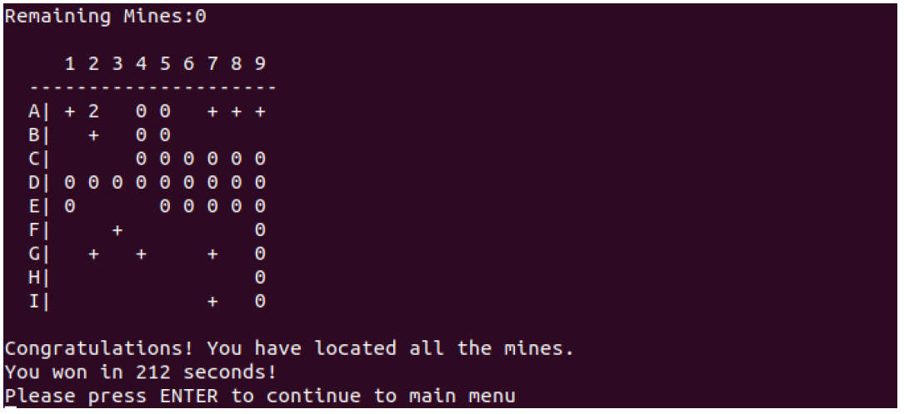

# CAB403_Assignment
The aim of this project is to design a server-client based Minesweeper application. The application is Linux based and runs on the terminals. 
The image below shows an example of a user winning a game.

## Specifications 
Details on project specifications are located in the **CAB403 Assignment Specification** PDF.
## Getting Started 
These instructions will get you a copy of the project up and running on your local machine for development and testing purposes.

### Prerequisite Installations
Any Linux distribution is needed to run this application.

### Compile and Run Application 
For information on how to use application, please refer to the **403 Report** document, under the section **Instructions to compile and run program**

## Versioning
Dropbox was used for version control. 

## Contributors 
Jonathan Salazar, Max Kingsman
